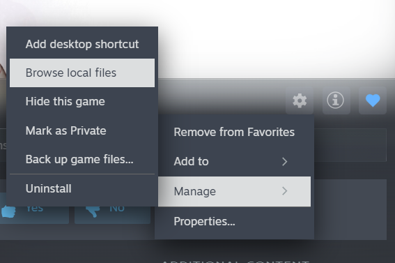
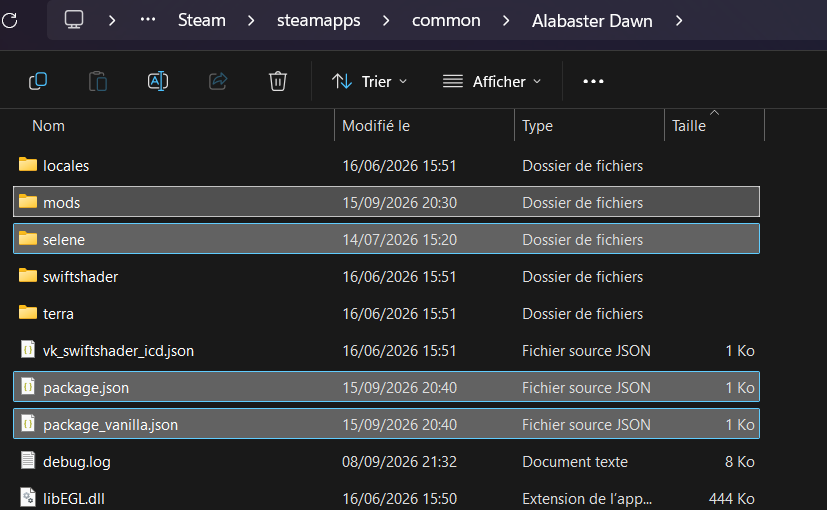

# Alabaster Dawn Client for Archipelago randomizer

The implementation is still very early in development, and is currently not recommended to use in a big multiworld (unless everyone in the game agrees to it). You will likely encounter bugs, crashes or logic issues (you should also use multiple save slots in case a softlock occurs). Please report any issue that you encounter ! (on Discord or in this repository)

If you have any questions, ideas or bug reports, feel free to ask in the [implementation thread](https://discord.com/channels/731205301247803413/1487693744177152030) of the AP discord.

## Setup

### Release files

The [releases](https://github.com/Satisha10/AlabasterDawnAPClient/releases/latest) contain these files:

- `client+modloader.zip`: AP client + the modloader. Download this one if you **don't** have the Project Selene modloader installed.
- `APClient.mod.zip`: AP client mod, **if you already have the modloader installed**. Put it directly in your `mods` folder (without extracting it).
- `alabaster_dawn.apworld`: AP World (optional, if you want to generate the game or for Universal Tracker to work).
- `alabaster_dawn.yaml`: Yaml template (optional).

### First installation (if you don't have the modloader)

Download the `client+modloader.zip` file in the [releases](https://github.com/Satisha10/AlabasterDawnAPClient/releases/latest). Extract it, and copy its content in your Steam game files (see left image to find this folder). It should override the `package.json` file, allow to replace it. After this, the game directory should look like the image on the right (the new files are highlighted).

 

Launch the game as usual, which should open the Project Selene modloader with the AP Client mod already installed. Press `Play` to start the game, connect using the menu on the top-right, and start a new game.

### Updating the mod (or if you already have the modloader)

Download the `APClient.mod.zip` file from the [releases](https://github.com/Satisha10/AlabasterDawnAPClient/releases/latest) and copy it **without extracting it** in the `mods` folder loacted in the game files.

## Effects of the randomizer

All of this is subject to changes as the development of this implementation (and of the base game) continues.

The goal is currently to finish the Eternal Spring dungeon in Koro Valley.

### Global changes

- The main plot of the game is skipped (aside from main quests and dungeons)
- All areas start regrown
- The level of enemies scales depending on how late the area is in vanilla (this might change, and there is currently no combat logic)

### Locations

- Chests
- Quests (main and side quests)
- Weapons and elements

### Items

- Weapons and elements
- Community levels
- Areas unlock (Dungeon keys, and remove some roadblocks like the water level for the dungeon or the bridges in Koro Valley)
- Gems (major gems, and constructs for minor gems)
- Divine arts
- Essences
- Dish recipes

### Notes

- Yaml-less Universal Tracker is supported.
- You can equip a weapon to multiple elements (this is needed to fix an issue, I might add back the vanilla behavior if I find a solution).
- If you want to play the vanilla game, remove the `package.json` file, and rename `package-vanilla.json` to `package.json`. Removing mods from the `mods` folder will also work.
- The AP World source code is on [another repository](https://github.com/Satisha10/Archipelago_wotw/tree/alabaster-dawn/worlds/alabaster_dawn).

## Planned features (in no particular order)

- Improve the client: cache the datapackages, display/format more messages
- Automatically connect when loading a save file, and check that it is the same multiworld
- Collect locations already checked in the server
- Add Nyx spires and nests as locations (and add the boss fights)
- Show the chests and their item classification on the map
- Progressive area unlocks
- Progressive gems
- Death link
- Start with random weapons
- Options to add locations for cooking dishes, crafting gems
- Randomize quest rewards and offerings (and scout the rewards)
- Combat balancing
- Random spawn
- Show the archipelago messages using the game UI
- Add a text client
- In-game logic tracker (maybe, and not anytime soon)
